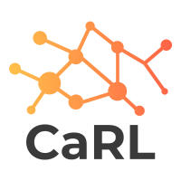
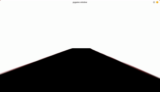

<p align="center" style="font-size:30px">

</p>
<p align="center" style="font-size:30px">
  <br>
  <em><strong>Ca</strong>r game for <strong>R</strong>einforcement <strong>L</strong>earning</em>
  <br>
</p>
<p align="center">
<a href="https://github.com/MatthiasSchinzel/Simple-Car-Game-For-Reinforcement-Learning/graphs/commit-activity">
    
</a>
<a href="https://github.com/MatthiasSchinzel/Simple-Car-Game-For-Reinforcement-Learning/blob/master/LICENSE">
    
</a>
<a href="https://github.com/MatthiasSchinzel/Simple-Car-Game-For-Reinforcement-Learning/tags/">
    
</a>
<a href="https://github.com/MatthiasSchinzel">
    
</a>
<a href="https://github.com/MatthiasSchinzel">
    
</a>
</p>
<p align="center">
  <a href="#key-features">Key Features</a> •
  <a href="#getting-started">Getting Started</a> •
  <a href="#authors">Authors</a> •
  <a href="#license">License</a> •
  <a href="#acknowledgments">Acknowledgments</a>
</p>

<h2>
Key features
</h2>



[](https://www.python.org/)

* **Easy to get started**: API close to OpenAI gym

* Inspired by **nature**: What information do you really need when driving a car? How much abstraction is too much? If you can play this game manually, the provided information is enough.

* **Examples available**: [**SAC**](https://github.com/MatthiasSchinzel/Soft-Actor-Critic-For-Simple-Car-Game) and [**GTA5**](https://github.com/MatthiasSchinzel/Soft-Actor-Critic-Playing-GTA)

* Create your **own track**: And this is *really* easy, you can even do it in paint!

* Intended bring RL closer to **real life application**: There are a lot of options to close the domain gap.

<h2>
Getting Started
</h2>

Maybe you want to play the game first manually to get a feeling for the game itself (1.2).

This is a simple car game is relying heavily on image warping (no 3D game), which you can use to test your reinforcement learning algorithms. The game can be played like any other game with a keyboard, but its main intention is to give openai gym-like python functions (consistency with openai gym not guaranteed). The game is giving feedback every frame. Aim is (especially for reinforcement learning) to maximize this score. The game is designed to make the race track creation as easy as possible. Therefore it is accept .png images as racing tracks. You can generate tracks (even multiple tracks) to suit your individual needs, or just rely on the prebuild tracks.


### 1.1. Requirements

You will need python 3 and the following libraries installed:
numpy, pygame and opencv-python (cv2). Use to following command to install the dependencies
```
pip install numpy pygame opencv-python
```

### 1.2. Play the game manually

Just run the command

```
python PlayingManually.py
```
Accelerate with W, brake with S, turn left with A and right with D.

### 1.3. Let your (reinforcement learning) algorithm play the game

If you ever used an openai gym game you might already be familiar. In case you are not, here the basics. Import the CarGame class first and initialize

```
from PygamePlayCar import CarGame
g = CarGame()
```
Acceleration goes from -1 to 1, as well as steering. You can also sample the action space with g.action_space.sample, which really is just a random number generator
```
done = False
direction = 1
acceleration = 1
while done == False:
     action_space, score, done, info = g.step(acceleration, direction)

g.reset()
```
Once you leave the race track, the game will end (done == True). Since the example above is going hard right with full acceleration, the game will end rather quick.

### 1.4. Create your own track

Creating a new racetrack is easy. Open an image manipulation software (GIMP or Inkscape for example). The higher resolution of the workspace, the bigger the map. Background should be plain white. If you can specify, select 8-bit depth. Now draw some line with constant thickness in black color (0, 0, 0) (in (R, G, B) notation). To specify the starting point just set a green point at the starting position (0, 255, 0) and specify the finish point with the color red (255, 0, 0). Make sure to use green (0, 255, 0) and not for example (10, 255, 10). That's it. Save the map as .png, add the path to the list of tracks in the .py file and maybe you should play your track manually first just to verify your track is working as intended.

Check out the supplied PNGs as as reference for getting started.

### 1.5. Scoring system

What is increasing the score:
- Driving over not yet driven parts of the track
- Smooth cornering
- The less steering changes the better

What is decreasing the score:
- Driving over already driven areas of the track (For example if you go straight, and then reverse. Just imagine the car is painting the street below the car in red. If you go again over that area, you won't get points for that again. )
- Shaky driving
- Stopping


Just in case it is still unclear: In this game maximizing the score means better driving performance. In case you need to minimize the score just flip the sign.

### 1.6. Why no 3D game?

The idea is, that maybe this abstraction of a driveable lane is enough. There exist a lot of methods out there to identify lane markings from images or a driveable area. In short: Real world --> driveable area (binary mask) -->  driving directions.

The thing with 3D games in my opinion is, that you will likely have a domain gap between real images and 3D generated images. This method gets rid of all the fancy 3D modeling of houses etc. For Real world --> driveable area you can have a look at BDD100K for example.

### 1.7. What is still missing?

I think a more realistic physical model of the car (so you can do drifting etc.) would be the next step.

After that maybe adding some other cars might be good, so the race track is changing dynamically.

Also a documentation of all possible settings inside the game might be useful.

## Authors

* [**Matthias Schinzel**](https://github.com/MatthiasSchinzel)

## License

MIT License, see LICENSE file.

## Acknowledgments

* Hat tip to [**AtsushiSakai/PythonRobotics**](https://github.com/AtsushiSakai/PythonRobotics) where I got inspiration for the car model. You should check out this repository.
